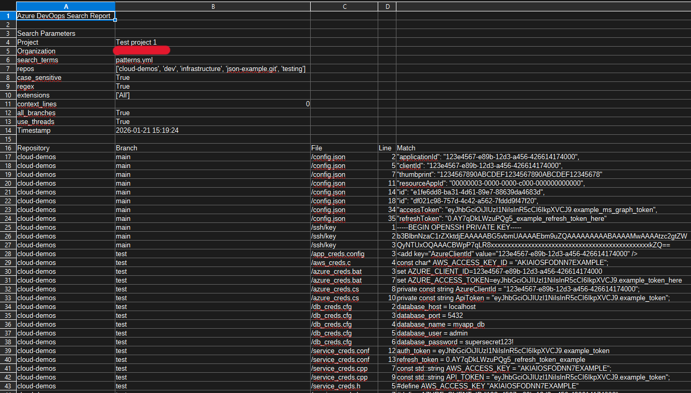
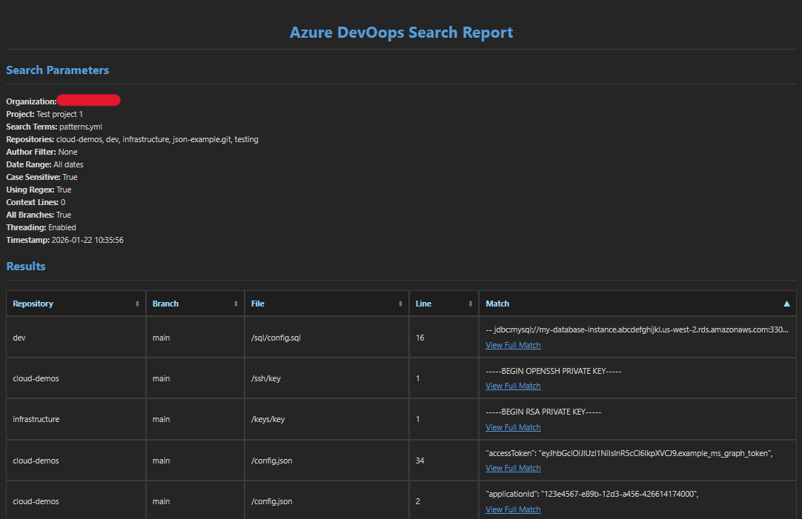

# DevOops.py

Azure DevOps code discovery script that enables red teamers to search, enumerate, and analyse files, commits, and repository contents, with enhanced filtering and CSV/HTML reporting.

<br>

## Introduction

Generated on the fly mid-engagement using raw HTTP requests to query the underlying Azure DevOps API. A code search extension is available in DevOps but it has to be installed from the marketplace which might have drawn unnecessary attention and it also is missing some desirable features. 

<p align="center">

</p>

The primary advanatage is regex support, not currently implemented within the code search extension. Threading also improves search speed within large environments (some envs might rate-limit but this is not always the case), context can be provided to identify where and how any identified secrets or credentials are being used within the codebase, and the option to export results to CSV or HTML provides easier analysis of results.


<br>

## Usage 

```
usage: devoops.py [-h] -o ORGANIZATION -p PROJECT (-c CREDENTIAL | -cf CRED_FILE) [--repos REPOS] [--list-repos] [--list-contents] [--search SEARCH]
                  [--branches BRANCHES] [--all-branches] [--case-insensitive] [--only-ext ONLY_EXT] [--regex] [--lines LINES]
                  [--exclude-repos EXCLUDE_REPOS] [--commits COMMITS] [--list-commits] [--author AUTHOR] [--from-date FROM_DATE] [--to-date TO_DATE]
                  [--no-threads] [--html-report] [--csv-report]

options:
  -h, --help            show this help message and exit
  -o ORGANIZATION, --organization ORGANIZATION
                        Azure DevOps organization name
  -p PROJECT, --project PROJECT
                        Azure DevOps project name
  -c CREDENTIAL, --credential CREDENTIAL
                        Raw authentication credential (PAT token or UserAuthentication=cookie)
  -cf CRED_FILE, --cred-file CRED_FILE
                        Path to file containing authentication credential
  --repos REPOS         Comma-separated list of repository names to display OR search (displays ALL if not specified)
  --list-repos          Only list repository names without showing contents
  --list-contents       List contents of repositories (--repos REQUIRED)
  --search SEARCH       Comma-separated list of file search strings, raw regex patterns (--regex REQUIRED), or YML file
  --branches BRANCHES   Comma-separated list of branch names to display OR search (displays ALL if not specified)
  --all-branches        List files or search across ALL branches
  --case-insensitive    Perform case-insensitive search
  --only-ext ONLY_EXT   Comma-separated list of file extensions to search (e.g., ".py,.js,.ps1")
  --regex               Treat search strings (--search REQUIRED) as regular expressions
  --lines LINES         Number of lines to show before and after matches for context
  --exclude-repos EXCLUDE_REPOS
                        Comma-separated list of repository names to exclude from search
  --commits COMMITS     Comma-separated list of commit search strings, raw regex patterns (--regex REQUIRED), or YML file
  --list-commits        List commits for specified repositories (--repos REQUIRED)
  --author AUTHOR       Filter commits by author (email or display name)
  --from-date FROM_DATE
                        Search commits from this date (YYYY-MM-DD)
  --to-date TO_DATE     Search commits until this date (YYYY-MM-DD)
  --no-threads          Disable multi-threaded branch searching
  --html-report         Generate an HTML report
  --csv-report          Generate an CSV report

Examples:
  devoops.py -o myorg -p myproject -cf cred
  devoops.py -o myorg -p myproject -cf cred --repos repo1,repo2
  devoops.py -o myorg -p myproject -cf cred --repos repo1 --search "TODO,FIXME" --all-branches
  devoops.py -o myorg -p myproject -cf cred --search "password" --lines 3 --exclude-repos test-repo,temp-repo
  devoops.py -o myorg -p myproject -cf cred --commits "secret" --author dev@target.com --from-date 2025-12-09
  devoops.py -o myorg -p myproject -cf cred --repos repo1 --search "<REGEX PATTERN>" --regex --case-insensitive --only-ext ".ps1,.json"

Regex:
  Client ID      [0-9a-fA-F]{8}-[0-9a-fA-F]{4}-[0-9a-fA-F]{4}-[0-9a-fA-F]{4}-[0-9a-fA-F]{12}
  Client Secret  [a-zA-Z0-9~.\-_]{40}
  Access Token   eyJ[a-zA-Z0-9_-]+\.[a-zA-Z0-9_-]+\.[a-zA-Z0-9_-]+
  Refresh Token  0.AY[A-Za-z0-9-_.+/=]*
```

<br>

## Search and Regex Functionality 

The `--search` and `--commits` flags support multiple input formats:
- Plain text strings
- Regex patterns (requires `--regex` flag)
- YAML files containing pre-defined search patterns

Search Modes:
- Default mode: Accepts only literal string matches
- Regex mode: Enables regex matching when `--regex` flag is used (strings can still be used)
- File-based search: Supports loading regex patterns from YAML config files

Examples:
```
devoops.py -o myorg -p myproject -cf cred --search 'password'
devoops.py -o myorg -p myproject -cf cred --regex --search 'password,[a-zA-Z0-9~.\-_]{40}'
devoops.py -o myorg -p myproject -cf cred --search patterns.yml 
```

The YML file structure is based on the [rules](https://github.com/mazen160/secrets-patterns-db/blob/master/db/rules-stable.yml) from [secrets-patterns-db](https://github.com/mazen160/secrets-patterns-db) which has been refined based on common cloud secrets and credentials but can be easily expanded to match various other secret types and search terms:

```yml
patterns:
    # Azure
    - pattern:
        name: Azure DevOps Personal Access Token (PAT)
        regex: "[0-9a-f]{52}"

    - pattern:
        name: Azure Connection String
        regex: "(?i)DefaultEndpointsProtocol=https;AccountName=[a-z0-9]+;AccountKey=[a-zA-Z0-9+/=]+"

    - pattern:
        name: Azure Client ID
        regex: "[0-9a-f]{8}-[0-9a-f]{4}-[0-9a-f]{4}-[0-9a-f]{4}-[0-9a-f]{12}"

    - pattern:
        name: Azure Client Secret
        regex: "[a-zA-Z0-9~.\\-_]{40}"

    - pattern:
        name: Azure Access Token
        regex: "eyJ[a-zA-Z0-9_-]+\\.[a-zA-Z0-9_-]+\\.[a-zA-Z0-9_-]+"

    - pattern:
        name: Azure Refresh Token
        regex: "0.AY[A-Za-z0-9-_.+/=]*"

    # AWS 
    - pattern:
        name: AWS API Gateway
        regex: "[0-9a-z]+.execute-api.[0-9a-z._-]+.amazonaws.com"

    - pattern:
        name: AWS API Key
        regex: AKIA[0-9A-Z]{16}

    - pattern:
        name: AWS ARN
        regex: arn:aws:[a-z0-9-]+:[a-z]{2}-[a-z]+-[0-9]+:[0-9]+:.+

    - pattern:
        name: AWS Access Key ID Value
        regex: (A3T[A-Z0-9]|AKIA|AGPA|AROA|AIPA|ANPA|ANVA|ASIA)[A-Z0-9]{16}
    ...
```

<br>

## File Types

The script searches and processes files with the following text-based extensions by default for the `--search` option:

```bash
# Source Code
.txt                     # Plaintext
.md                      # Markdown
.py                      # Python
.js  .jsx                # JavaScript and React
.ts  .tsx                # TypeScript and React TypeScript
.java                    # Java
.c  .cpp  .h  .hpp       # C and C++
.cs                      # C#
.go                      # Go
.rb                      # Ruby
.php                     # PHP
.pl                      # Perl
.swift                   # Swift
.m .mm                   # Objective-C

# Web
.html  .htm              # HTML
.css  .scss  .less       # CSS and preprocessors
.xml                     # XML
.json                    # JSON
.yml  .yaml              # YAML
.sql                     # SQL

# Configuration and Scripting
.ini .conf .cfg .config  # Configuration
.sh .bash                # Linux
.bat .cmd .ps1           # Windows batch

# Additional Extensions
.properties              # Java properties
.toml                    # TOML configuration
.env                     # Environment variables
.log                     # Log files

# Sepcial File Types - Filename starting with (below) or with no extension
'.'                      # Hidden files
'_'                      # Temporary or system files
'~'                      # Backup or temporary files
```

<br>

## Reporting

CSV and/or HTML reports can be generated as the CLI output can be messy with large environments.

Example CSV report:

<p align="center">

</p>

<br>

Example HTML report:

<p align="center">

</p>

<br>

## Credits

- [h4wkst3r](https://github.com/h4wkst3r) for [ADOKit](https://github.com/h4wkst3r/ADOKit) as this is basically a slightly enhanced version of the code search feature
- [mazen160](https://github.com/mazen160) for [rules-stable.yml](https://github.com/mazen160/secrets-patterns-db/blob/master/db/rules-stable.yml) which was used as a base for the YML regex search


<br>

## Improvements

- [ ] Add `AadAuthentication` auth
- [ ] Timing options/rate limiting support
  - rate limiting impacted the search performance on a recent job
  - disabling threading `--no-threads` and adding timing options would be useful